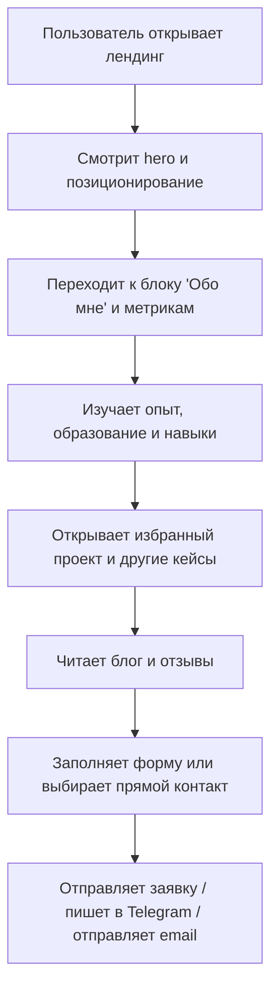

## 1. Обзор продукта
Личный лендинг-портфолио Александра Андросенко для презентации опыта, стека, ключевого проекта и удобной связи с потенциальными заказчиками и работодателями.
- Сайт решает задачу быстрого доверительного знакомства: кто такой Александр, что умеет, над чем работал и как с ним связаться.
- Ценность продукта в сильной визуальной подаче, запоминающемся личном бренде и понятной воронке к заявке на разработку.

## 2. Ключевые функции

### 2.1 Функциональные модули
1. **Главный экран**: имиджевый hero-блок, краткое позиционирование, CTA, атмосферная анимация.
2. **Обо мне**: личное описание, ключевые цифры опыта, география, контакты, сайт.
3. **Образование и развитие**: блок с ДПО, курсами и обучением в формате выразительной таймлайн-композиции.
4. **Опыт и стек**: опыт по направлениям Frontend / Backend, список технологий, инструменты.
5. **Избранный проект**: акцентный кейс проекта «Дело по плечу» с результатами, функциями и стеком.
6. **Проекты и блог**: карточки избранных работ и заметок для усиления экспертности.
7. **Отзывы**: короткие социальные доказательства в виде лаконичных карточек.
8. **Контакты**: форма обратной связи, прямые способы связи, ссылки на соцсети и CTA на заказ разработки сайта.

### 2.2 Детализация страниц и модулей
| Название страницы | Название модуля | Описание функции |
|---|---|---|
| Главная `/` | Hero | Крупное имя, роли Front-End / Backend Developer, город, короткий манифест, кнопки «Обсудить проект» и «Смотреть кейсы», плавные анимации появления, акцентная типографика |
| Главная `/` | Навигация | Якорное меню по разделам: Обо мне, Проекты, Блог, Отзывы, Контакты; липкое поведение на десктопе |
| Главная `/` | Обо мне | Раскрывает профессиональный профиль, 5 лет в IT, гибридный профиль backend/frontend, реальные контакты и ссылки |
| Главная `/` | Метрики | Показывает 3-4 ключевых показателя: годы опыта, реализованные проекты, направления разработки, стек |
| Главная `/` | Образование | Лента обучения: СОТА, КОД, КодБудущего, Дело по Плечу, с периодами и специализациями |
| Главная `/` | Опыт | Блоки с опытом стажировки и коммерческой/проектной разработки, упор на конкретные задачи и результат |
| Главная `/` | Навыки | Группировка по языкам, frontend, backend, инструментам и Dev/Designer related |
| Главная `/` | Избранный проект | Кейс «Дело по плечу» с описанием продукта, функций, результатов, стеком и визуальным акцентом |
| Главная `/` | Проекты | Сетка карточек с ключевыми проектами, включая «ТурКод» и другие релевантные работы |
| Главная `/` | Блог | 3 карточки статей/заметок как экспертный блок, даже если контент пока демонстрационный |
| Главная `/` | Отзывы | 2-3 лаконичных отзыва с фокусом на ответственности, скорости и системном мышлении |
| Главная `/` | Контакты | Форма заявки, email, Telegram, сайт, GitHub, ссылки на профиль, блок согласия на обработку данных |
| Главная `/` | Footer | Копирайт, политика конфиденциальности, вторичная навигация, короткий брендовый финал |

## 3. Ключевые пользовательские сценарии
Посетитель открывает сайт и за первые 5-10 секунд понимает специализацию Александра, видит сильную визуальную подачу и получает быстрый путь к кейсам или контакту. Затем он скроллит страницу как историю: личность, опыт, стек, кейс, доказательства, форма связи. На любом этапе пользователь может перейти к заявке, написать в Telegram или отправить письмо.

## 4. Дизайн интерфейса

### 4.1 Стиль дизайна
- Основная палитра: глубокий графит `#0A0A0A`, молочный белый `#F5F3EE`, холодный серый `#8C877F`, дымчатый `#171717`, серебряный акцент `#C9C4BA`
- Дополнительный акцент: приглушенный неоновый ледяной `#9FE3D8` только в интерактивных состояниях и тонких линиях
- Кнопки: крупные, плотные, с мягким радиусом, контрастной заливкой и анимированной рамкой
- Типографика: выразительный дисплейный гротеск для заголовков + аккуратный читабельный гротеск для текста + моноширинный акцент для меток и дат
- Макет: desktop-first, крупные поля, кинематографичные разрывы между секциями, асимметрия и плавающие подписи
- Иконография: минималистичные линейные элементы, акцент на типографику и ритм сетки вместо перегруженных иконок

### 4.2 Обзор дизайна по модулям
| Название страницы | Название модуля | UI-элементы |
|---|---|---|
| Главная `/` | Hero | Массивный типографический блок, фон с градиентным свечением и зерном, анимированные линии, плавные reveal-анимации |
| Главная `/` | Обо мне | Двухколоночный блок с биографией и фактами, аккуратные разделители, контрастные подписи |
| Главная `/` | Таймлайн | Вертикальная лента с датами, точками, смещенными карточками, мягким parallax-эффектом |
| Главная `/` | Навыки | Кластерные карточки-лейблы с разной плотностью и динамикой наведения |
| Главная `/` | Избранный проект | Крупная кейс-секция с большим названием, списками результата, стека и демонстрацией структуры продукта |
| Главная `/` | Блог | Тонкие карточки как editorial-блок, без шаблонного «маркетингового» вида |
| Главная `/` | Отзывы | Контрастные карточки на светлом фоне внутри темной страницы для смены ритма |
| Главная `/` | Контакты | Светлый финальный блок с темной формой, крупный заголовок и удобные быстрые ссылки |

### 4.3 Адаптивность
Дизайн проектируется в desktop-first логике с адаптацией под планшет и мобильные устройства. На мобильных экранах hero собирается в вертикальную композицию, таймлайн упрощается, анимации становятся мягче, сетка карточек перестраивается в одну колонку, все CTA остаются крупными и доступными для тапа.

### 4.4 Контентные допущения
- Блог и отзывы на первом этапе могут быть оформлены как демонстрационные карточки на основе текущего позиционирования.
- Форма связи на первом этапе работает как интерфейс захвата заявки и может быть подключена к реальному обработчику позднее.
- Все персональные данные и контакты берутся из предоставленного пользователем описания и при необходимости легко редактируются через конфигурационный объект.
