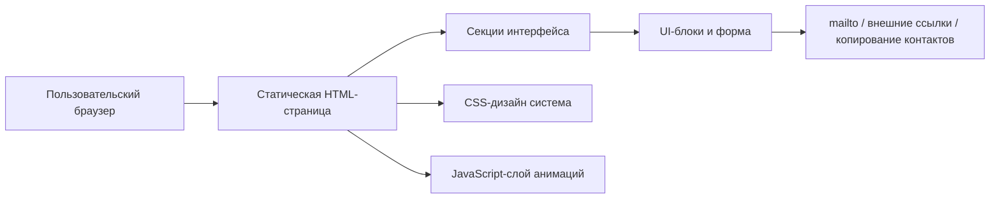
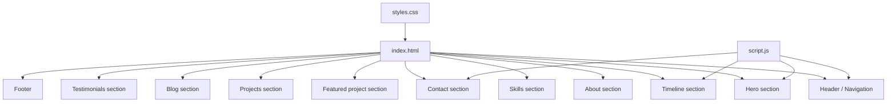

## 1. Архитектура решения
Лендинг реализуется как статический одностраничный сайт на HTML, CSS и JavaScript без собственного backend. Контент размещается прямо в разметке и частично управляется через легкий клиентский скрипт для навигации, анимаций и формы связи.



## 2. Технологии
- Frontend: HTML5 + CSS3 + JavaScript (ES2020)
- Стилизация: CSS-переменные, grid/flex-layout, кастомные анимации и эффекты зерна/свечения
- Анимации: CSS transitions + keyframes + Intersection Observer для reveal-эффектов
- Иконография: текстовые маркеры и минималистичные символы без тяжелых библиотек
- Хранение контента: статическая разметка и легкий JS для интерактивных состояний
- Деплой: любой static hosting, включая GitHub Pages, Vercel, Netlify

## 3. Определение маршрутов
| Маршрут | Назначение |
|---|---|
| `/` | Главный лендинг-портфолио со всеми секциями |

## 4. Определение API
Собственный backend на первом этапе не требуется.

### 4.1 Логика формы
- Валидация обязательных полей на клиенте
- После успешной отправки:
  - формируется `mailto:` ссылка с темой и телом письма, либо
  - выводится success-состояние с альтернативными способами связи
- Ошибки показываются рядом с полями и не ломают прокрутку страницы

## 5. Архитектура клиента


## 6. Структура данных и файлов

### 6.1 Целевая структура проекта
```text
index.html
styles.css
script.js
.trae/
  documents/
```

### 6.2 Принципы организации
- Все основные цвета, отступы, тени и типографика задаются через CSS-переменные.
- Каждая секция собирается как самостоятельный HTML-блок с предсказуемой структурой классов.
- Анимации строятся с учетом `prefers-reduced-motion`.
- JavaScript отвечает только за reveal-эффекты, мобильное меню, активную навигацию и форму.

## 7. Нефункциональные требования
- Высокая визуальная выразительность без ощущения шаблона или «сгенерированного» дизайна
- Быстрая первая загрузка за счет статического фронтенда и умеренного количества зависимостей
- Полная адаптивность начиная с 320px
- Контрастность текста и заметный keyboard focus
- Аккуратная деградация анимаций на слабых устройствах

## 8. Решения по визуальной реализации
- Основа интерфейса: темная сценография с теплым белым текстом и тонким холодным акцентом
- Signature-элемент: «редакционно-кинематографичный» hero с крупной типографикой, движущимися линиями и layered-ритмом секций
- Анимационный подход: не много мелких эффектов, а несколько сильных моментов - hero reveal, таймлайн scroll-reveal, пластичный hover карточек, мягкое появление формы
- Фотографии не обязательны; визуальная сила достигается типографикой, графическими линиями, зерном и композицией
